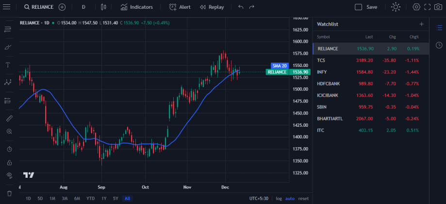

# openalgo-chart

> **WARNING — Localhost Only:** This project is intended to run on a local development server (http://localhost). Some features (API access, CORS, or websocket connections) may not work correctly when served from a remote host or different origin.

A openalgo charting using `lightweight-charts` and React.

## Quick start

- Clone the repo:

```bash
git clone https://github.com/crypt0inf0/openalgo-chart.git
```

- Change into the project directory:

```bash
cd openalgo-chart
```

- Install dependencies:

```bash
npm install
```

- Build for production:

```bash
npm run build
```

- Run the dev server:

```bash
npm run dev
```

You can also preview a production build locally with:

```bash
npm run preview
```

## Screenshot



## License

MIT